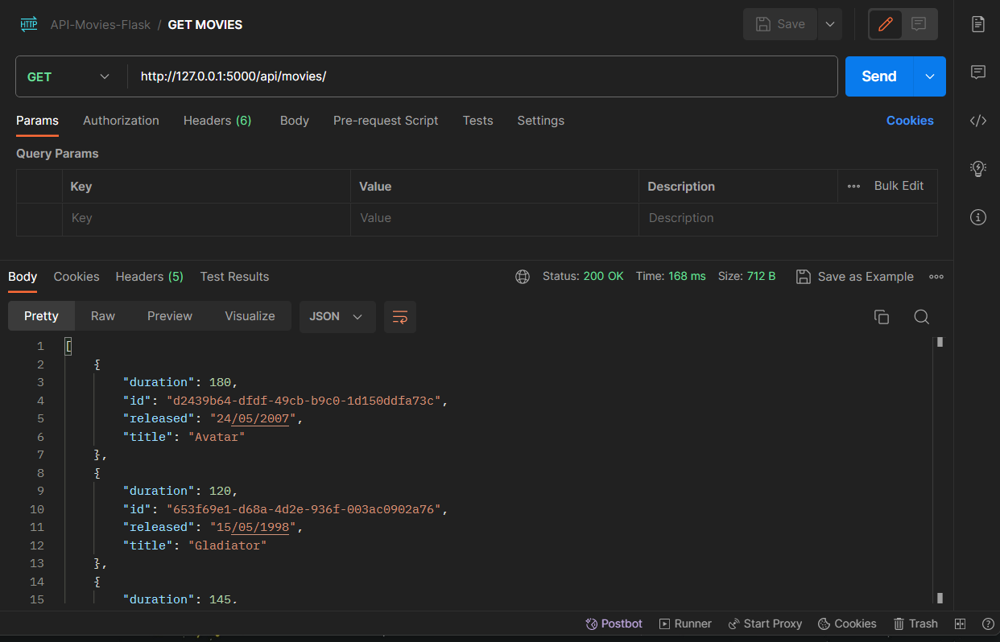
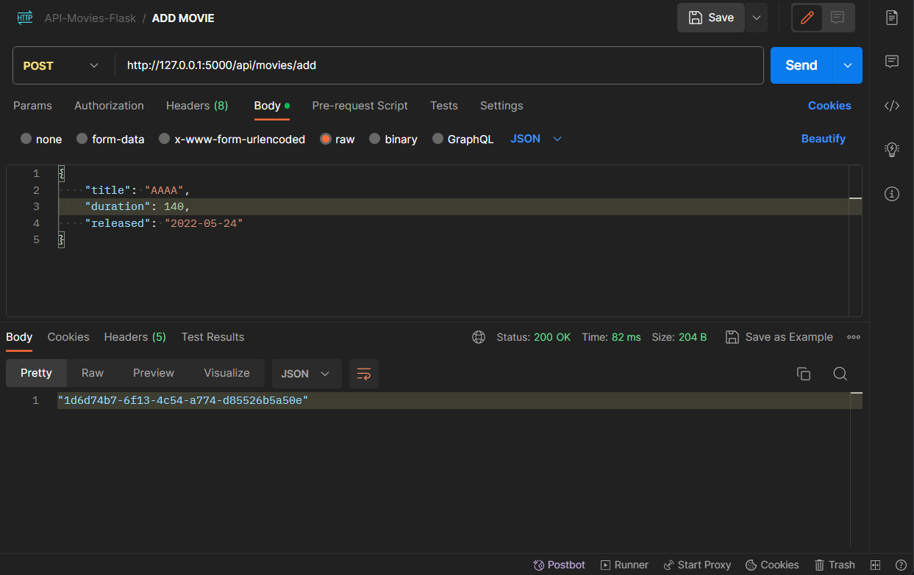
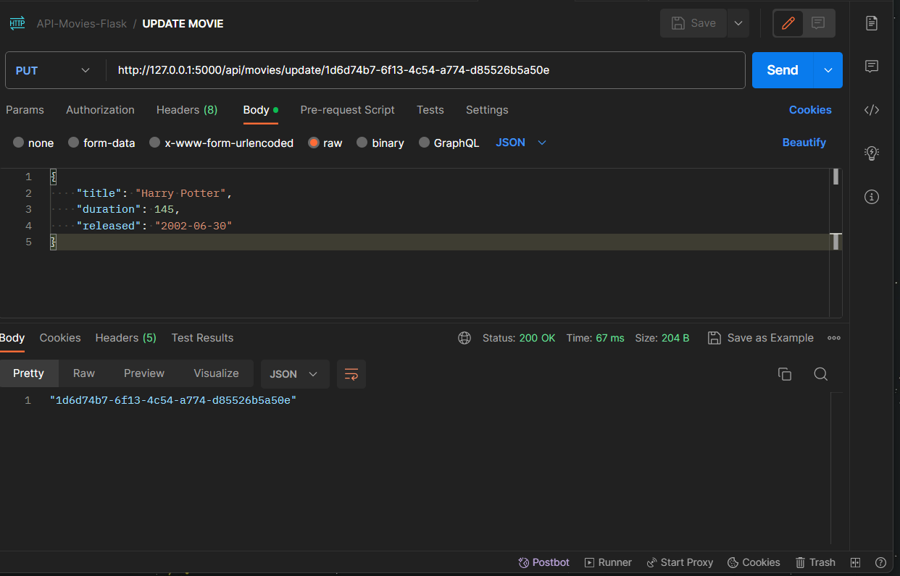
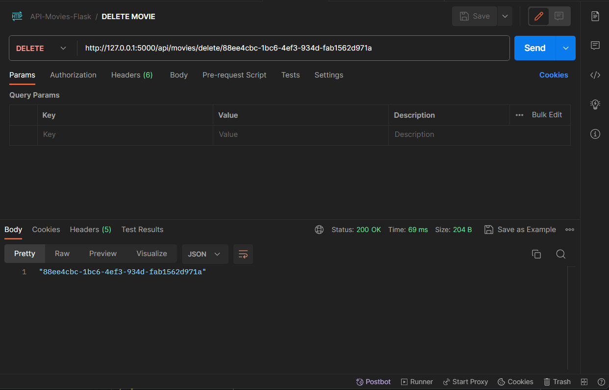

# REST API with Python, Flask and PostgreSQL

REST API with Python, Flask, and PostgreSQL. Using the HTTP protocol along with the GET, POST, PUT, and DELETE methods and JSON format for sending and receiving data.

First, create a virtual environment:"
### `python -m virtualenv env`

To install the necessary packages:
### `pip install -r requirements.txt`

Create a .env file (at the project's root) for environment variables:

### `SECRET_KEY=SECRET_KEY`
### `PGSQL_HOST=host`
### `PGSQL_USER=user`
### `PGSQL_PASSWORD=password`
### `PGSQL_DB=database`

## Contact me
If you have any comments, please do not hesitate to contact me:
- **Website:** [www.ozkar.codes](https://www.ozkar.codes/)
- **Email:** ozkarhdz@skiff.com
- **Twitter:** [@OzkarHdz_](https://twitter.com/OzkarHdz_)
- **Mastodon:** [sivar.cafe/ozkarhdz](https://sivar.cafe/@ozkarhdz)